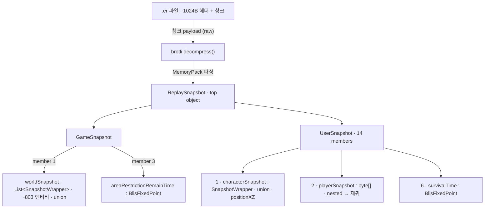

# secret_replay — Eternal Return `.er` 리플레이 포맷 리버싱

이터널 리턴(Eternal Return) 공식 리플레이 파일 `.er`의 바이너리 포맷을 리버스 엔지니어링하고, 디코더 + 시각화 뷰어까지 구현한 작업물.

> 리플레이 데이터 읽기 용도. 안티치트 우회·실시간 게임 조작 없음.

## 핵심 결론

`.er` 레코드 payload = **Brotli 압축 → MemoryPack 직렬화**

- 이전엔 "커스텀 비트팩·해독 불가"로 오판됐음 — 실제로는 **Brotli(magic 바이트 없어 압축 감지 우회됨) + MemoryPack(Cysharp 오픈소스)** 조합.
- IL2CppDumper 출력(`CharacterStatusSnapshot : IMemoryPackable`, `[MemoryPackOrder]`)으로 정체 판명 + 필드 순서 확보.
- 압축 해제하면 `gameId`·좌표·HP·스탯이 그대로 읽히고, **캐릭터·버프·레벨·사망까지 시계열로 복원**됨.

## MemoryPack 구조

`.er` payload에 도달하는 레이어 → MemoryPack 최상위 컨테이너 계층:



### 원시 와이어 타입 (모두 little-endian)

| 타입 | 와이어 레이아웃 |
|---|---|
| **object** | `[1B member-count]` (0–249 = 멤버 수, `0xFF`=null) → `[MemoryPackOrder]` 순서로 멤버. 상속 시 base가 먼저 |
| **collection** `T[]`·`List<T>` | `[int32 length]` (`−1`=null) → N개 원소 |
| **byte[]** · nested | `[int32 length]` → raw bytes. 중첩 스냅샷 = 별도 MemoryPack blob → **재귀** |
| **string** | `[int32 a][int32 utf16Len][utf8]`, **utf8Len = ~a** (a는 음수). `a=0`→`""`, `a=−1`→null |
| **BlisFixedPoint** | `object { int internalValue }`, 월드값 = `internalValue / 100` |
| **union** (SnapshotWrapper) | 별도 태그 바이트 없음 — member-count 헤더가 서브타입: `0x07`=Full, `0x04`=Basic. 멤버 #1 `objectType`이 엔티티 종류 |

### 바이트 판독 예

한글 닉네임 문자열 — `~(−10) = 9`바이트 UTF-8, UTF-16 글자수 3:
```
F6 FF FF FF   03 00 00 00   EB 8B A4  EB A5 B4  EC BD 94
└ int32 −10   └ utf16Len 3  └────── 9B utf-8 = "다르코" ──────┘
   (utf8Len = ~a = 9)
```

엔티티 스냅샷 레코드 시작 — member-count `0x07`=Full, 첫 int32 필드가 종류 판별:
```
07            02 00 00 00          …
└ member 7    └ objectType = 2     └ objId (member 2)
  = Full        = PlayerCharacter
```

> 한 스냅샷에 SnapshotWrapperFull 158 + Basic 2, 그중 `objectType=2`(플레이어) 24개.

## 완료 상태 (풀 디코드 + 뷰어)

| 항목 | 상태 |
|---|---|
| 포맷 (Brotli+MemoryPack) | ✅ 확정 |
| 컨테이너 (ReplaySnapshot→GameSnapshot→userList) | ✅ gameId/seq/24명 일치 |
| **위치** | ✅ 실제 맵 정렬 (dakgg 대조 오차 중앙 0.43 그리드) |
| **HP·SP·레벨·실드·extraPoint** | ✅ per-tick 스냅샷 |
| **characterCode·캐릭터명** | ✅ (예: 74=다르코) — 前 블로커 해결 |
| **버프 타임라인** | ✅ `buff_gain`/`buff_lose` 2,748건 (버프코드 + tick) |
| **레벨업·사망 이벤트** | ✅ `levelup` 336 · `death` 57 |
| **델타 60Hz → 위치/HP 타임라인** | ✅ `delta_timeline.json` (프레이밍·byte-align 해독) |
| **실제 맵 렌더** | ✅ Unity `Game.unity` → `DetailedMap.glb` 월드좌표 정렬 + 시야(fog of war) |
| string 인코딩 | ✅ `[~utf8len][utf16len][utf8]` |
| union (SnapshotWrapper) | ✅ 0x07=Full/0x04=Basic, objectType 판별 |
| 스킬 사용 이벤트 | ◑ 타임라인 미추출 (버프/레벨/사망만 이벤트화) |
| 투사체 조준좌표 / 글로벌 상태 | ⛔ 미해석 |

## 시각화 뷰어 (`viewers/`, 자립형 HTML)

| 파일 | 내용 |
|---|---|
| `replay_er.html` | **2D 리플레이** — 실제 맵 배경 + 24명 이동/HP 재생, 회전 정렬, 위치 보간, 시야(fog), 줌/팬, 3인 팀 |
| `replay_3d.html` | **3D 뷰어** — three.js + `DetailedMap.glb` 위 궤적 재생 |
| `replay_minimap.html` | 미니맵 스타일 재생 |
| `data_compare.html` | 원본 payload ↔ 해석 결과 대조 |
| `verify_replay.html` | 독립 검증(나란히 보기) |

## 파일 구조

| 폴더/파일 | 내용 |
|---|---|
| `docs/er-replay-format.md` | **완전 포맷 레퍼런스** — 파일 레이아웃, 레코드 프레이밍, Brotli, MemoryPack 와이어 포맷, 컨테이너 계층, 엔티티 레이아웃, 좌표 변환, 바이트 예제 |
| `decoder/er_decode.py` | 메인 디코더 (프레이밍 → Brotli → MemoryPack → 엔티티 위치/HP/스탯) |
| `decoder/` | MemoryPack 파서·스키마 추출·좌표 추출 스크립트 |
| `schema/schema.json` | dump.cs에서 추출한 976개 MemoryPackable 클래스 스키마 |
| `schema/mempack_meta.json` | union 태그맵 + 필드 오프셋 (경험적 확정분) |
| `data/log_data.json` | 24명 시계열 — 캐릭터·per-tick 스냅샷(hp/sp/level/shield) + 이벤트(버프·레벨업·사망) |
| `data/delta_timeline.json` | 델타 디코드 결과 — 오브젝트별 `[tick, x, z, hp]` 타임라인 |
| `data/er_dense_traj.json` | 24명 궤적 (그리드좌표, HP) |
| `data/names.json` | 코드↔이름 매핑 |
| `data/DetailedMap.glb` · `map_*.png` | 실제 루미아 맵(3D) + 미니맵/탑다운/시야 텍스처 |
| `viewers/*.html` | 자립형 시각화 (위 표) |
| `unity_export/` | Unity에서 맵을 GLB로 뽑는 익스포터 + 절차 |
| `research/` | 리버싱 과정 스크립트 + 발견 노트 |

## 남은 과제

핵심 디코드(위치·HP·스탯·캐릭터·버프·델타)와 시각화는 완료. 남은 것:
- **스킬 사용 이벤트** — 스냅샷엔 상태만 있고 스킬 발동은 별도 커맨드/델타 필드로 추정, 타임라인 미추출.
- **투사체 조준좌표 / 글로벌 상태** — 해당 MemoryPack 타입의 깊은 필드 미해석.

## 좌표계

월드좌표(Vector2Int/float) → dakgg 미니맵 그리드 (아이소메트릭 아핀):
```
gridX = -1.645*(x + z) + 290.1
gridY = -1.653*x + 1.652*z + 555.0
```
3D 뷰어는 월드좌표를 그대로 사용(맵 GLB와 동일 공간, x축 부호만 flip).

## 리플레이 취득

- **dakgg** (무인증): `er.dakgg.io/api/v1/rpc/replay?gameId=X` → `.bin` (AES-128-CBC 키=IV=0) — 닥지지 재가공 포맷
- **공식 `.er`** (세션 인증): `ReplayApi.FindReplayGame` → `bser-rest-release.bser.io/api/external/findReplayGame/{gameId}/{userNum}` — 게임사 비공개 API
